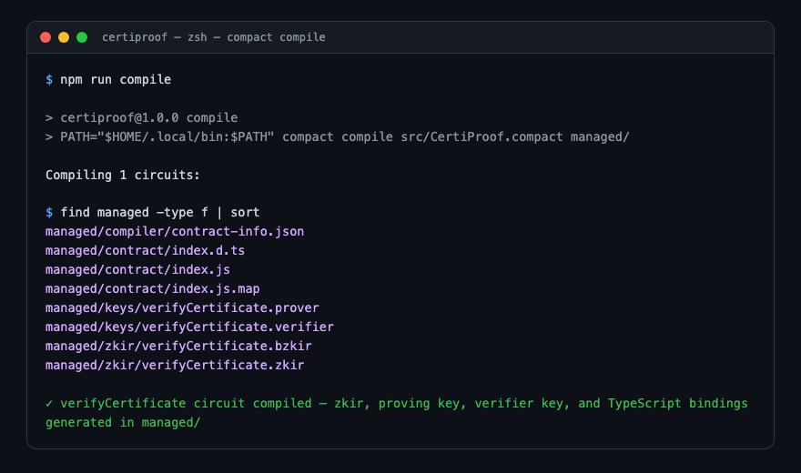
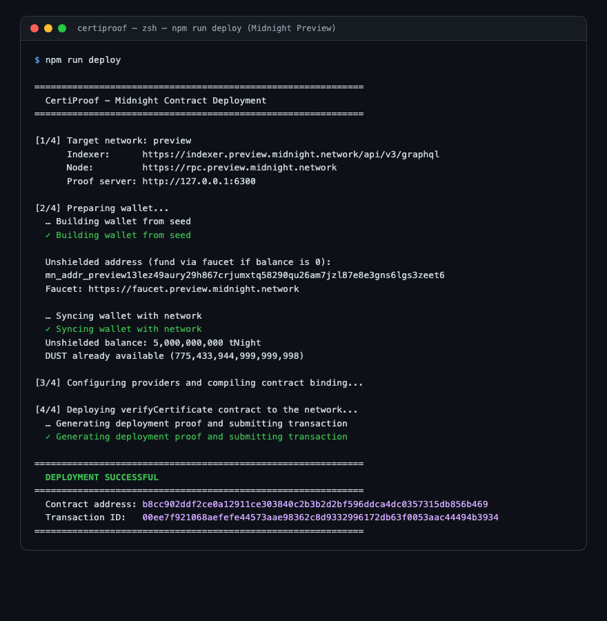

# CertiProof

> **Privacy-Preserving Student Certificate Verification Using Zero-Knowledge Proofs on the Midnight Network**

Built with Midnight's **Compact language** (toolchain `0.30.0`, language `0.22.0`, ledger `8.0.2`, compact-runtime `0.15.0`), zero-knowledge circuits, private witnesses, and controlled disclosure (`disclose()`).

> **Why toolchain 0.30.0?** This is the newest Compact toolchain whose generated `compact-runtime` version (`0.15.0`) has a matching, non-beta `midnight-js` deployment SDK release (`@midnight-ntwrk/midnight-js@4.0.4`) — the same combination used by Midnight's own actively-maintained [`example-counter`](https://github.com/midnightntwrk/example-counter) reference app. The newest toolchain (`0.34.0`) targets `compact-runtime@0.19.0`, which currently only has a pre-release (`5.0.0-beta.x`) JS SDK — riskier for a real deployment.

---

## Project Overview

In traditional educational credential systems, verifying an academic prerequisite (such as proving a student achieved marks $\ge 60$ in a course) requires sharing an entire transcript. This unnecessarily reveals confidential student records, exact scores, and personal identifiers to third-party employers, recruiters, or background checking services.

**CertiProof** solves this by using zero-knowledge proofs. A student generates a cryptographic proof locally on their device using a private witness. The Compact smart contract evaluates the zero-knowledge constraint (`marks >= 60`) and commits only a unique certificate digest to the public Midnight ledger. Relying parties can verify qualification without ever learning the student's exact numerical score or private identity.

---

## Product Idea

> "ZK-Certificate-Verifier (CertiProof) is a privacy-preserving student credential verification system. It allows students to prove that they satisfy a requirement, such as achieving a minimum score in a course, without publicly revealing their exact marks or other private certificate information. The project uses Midnight's Compact language, zero-knowledge circuits, private witnesses, and controlled disclosure through `disclose()` to demonstrate how educational credentials can be verified while protecting student privacy."

---

## Why Zero-Knowledge Proofs?

1. **Confidentiality & Compliance**: Protects sensitive academic records in compliance with FERPA, GDPR, and student privacy laws.
2. **Data Minimization**: Third parties only receive verifiable proof that the student met the criteria, rather than full academic histories.
3. **Tamper-Proof Integrity**: Cryptographic certificate commitments (`persistentHash`) anchored on the Midnight ledger prevent credential fabrication.
4. **Anti-Bias Protection**: Prevents employers from unfairly ranking or filtering candidates when only minimum qualification is required.

---

## How CertiProof Works

```text
Student enters private certificate information (ID, Marks, Salt)
                             ↓
             Private witness is created off-chain
                             ↓
             ZK circuit checks constraint: marks >= 60
                             ↓
             Zero-Knowledge Proof is generated
                             ↓
         Only necessary information is disclosed:
          • disclose(certHash)
          • disclose(true)
                             ↓
   Public verification state is updated on Midnight ledger:
    • verifiedCertificates[certHash] = true
    • totalVerified += 1
                             ↓
  Verifier / Employer confirms the credential on blockchain!
```

---

## Public State vs Private Witness

| Information | Public/Private | Reason |
| :--- | :--- | :--- |
| **Certificate verification status** | **Public** | Verifiers and relying parties need to confirm that the credential was verified. |
| **Certificate hash (`persistentHash`)** | **Public** | Uniquely identifies the credential on-chain without revealing private details. |
| **Total verified counter (`Counter`)** | **Public** | Public aggregate count of total credentials verified. |
| **Exact student marks** | **Private** | Personal educational information; qualifying ($\ge 60$) does not require revealing the score. |
| **Student ID** | **Private** | Personal identifier; kept confidential to prevent cross-service identity correlation. |
| **Certificate salt / entropy** | **Private** | High-entropy blinding factor preventing brute-force dictionary pre-image attacks. |

Zero-knowledge verification allows the system to verify a statement without unnecessarily revealing the underlying private information.

---

## How disclose() Is Used

In Compact, privacy is strictly guarded by default. Values originating from private witnesses are treated as private. Attempting to write witness-derived values to the public ledger without explicit approval triggers a compile-time exception. `disclose()` signals intentional, audited release of data to public ledger state.

### Implementation in `src/CertiProof.compact`:

```compact
// 1. ZK Circuit enforces qualification constraint
assert(cert.marks >= 60, "Student marks must be at least 60 to pass verification");

// 2. Derive cryptographic certificate hash
const certHash = persistentHash<StudentCertificate>(cert);

// 3. Controlled disclosure to the public ledger:
verifiedCertificates.insert(disclose(certHash), disclose(true));
totalVerified.increment(1);

return disclose(certHash);
```

### Key Rationale:
* **Why is `certHash` disclosed?**  
  Third parties need an immutable, public identifier to verify that this specific credential exists and passed verification.
* **Why is `true` disclosed?**  
  The ledger mapping `verifiedCertificates` records the boolean verification flag.
* **What information remains private?**  
  `cert.marks`, `cert.studentId`, `cert.subjectId`, and `cert.salt` are **never** wrapped in `disclose()`. They stay strictly in client-side witness evaluation.
* **Why would disclosing private marks be undesirable?**  
  Exposing exact marks destroys student privacy and violates data protection standards when only binary qualification is required.

---

## Project Structure

```text
CertiProof/
├── src/
│   ├── CertiProof.compact               # Primary Compact smart contract
│   └── CertificateVerifier.compact      # Alias contract definition
├── managed/                             # Real compiler-generated artifacts
│   ├── zkir/                            # Zero-Knowledge Intermediate Representation
│   │   ├── verifyCertificate.zkir       # Textual ZKIR circuit definition
│   │   └── verifyCertificate.bzkir      # Binary ZKIR bytecode
│   ├── keys/                            # Proving and verification keys
│   │   ├── verifyCertificate.prover     # Client proving key
│   │   └── verifyCertificate.verifier   # On-chain verifier key
│   ├── contract/                        # Auto-generated TypeScript bindings
│   │   ├── index.d.ts                   # Contract interfaces & types
│   │   ├── index.js                     # Contract logic module
│   │   └── index.js.map                 # Source map
│   └── compiler/                        # Build manifests & metadata
│       └── contract-info.json
├── tests/
│   ├── CertiProof.test.ts               # Primary Vitest unit & ZK circuit test suite
│   └── CertificateVerifier.test.ts      # Verifier test suite
├── scripts/
│   ├── config.ts                        # Network configuration (Preview / Preprod)
│   └── deploy.ts                        # Real Midnight SDK deployment script
├── public/                              # Interactive demonstration UI
│   ├── index.html                       # Verification interface
│   ├── styles.css                       # Dark-mode styles
│   └── app.js                           # Interactive client simulation
├── screenshots/                         # Verification screenshot guidelines
│   └── README.md
├── package.json                         # Node.js project manifest & scripts
├── package-lock.json                    # Lockfile with resolved dependencies
├── tsconfig.json                        # TypeScript configuration
├── .gitignore                           # Excludes .env and secrets
└── .env.example                         # Environment configuration template
```

---

## Toolchain & Requirements

* **Node.js**: `v20+` or `v22+` or `v24+` (`v24.21.0` tested)
* **npm**: `v10+` or `v11+` (`v11.19.0` tested)
* **Compact Compiler**: `compact` CLI, pinned to toolchain `0.30.0` (Language version `0.22.0`, Ledger version `8.0.2`, Compact Runtime `0.15.0`)
* **Docker**: required to run the local ZK proof server for deployment

Install the Compact CLI and select the matching toolchain:
```bash
compact update 0.30.0
compact compile --version        # 0.30.0
compact compile --runtime-version # 0.15.0
```

---

## Quickstart Commands

### 1. Install Dependencies
```bash
npm install
```

### 2. Compile the Compact Contract
```bash
npm run compile
```
*Compiles `src/CertiProof.compact` and generates circuits, proving keys, and contract bindings in `managed/`.*

### 3. Run Automated Tests
```bash
npm test
```
*Executes all Vitest unit and circuit tests against `@midnight-ntwrk/compact-runtime`.*

### 4. Run the Local Demo Interface
```bash
npx serve public
# or: python3 -m http.server 8080 --directory public
```

---

## Test Suite Coverage

The test suite covers:
1. **Passing Verification**: Students with marks $\ge 60$ pass verification and produce a valid 32-byte hash.
2. **Failing Verification**: Students with marks $< 60$ trigger circuit assertion failure (`assert(cert.marks >= 60)`).
3. **Public Ledger State Updates**: Asserts that `totalVerified` increments and `verifiedCertificates` records the hash.
4. **Privacy Non-Disclosure**: Confirms that student marks, student ID, and salt are **never** present in public ledger state.
5. **Deterministic Hashing**: Proves identical credentials yield deterministic `persistentHash` commitments.
6. **Boundary Conditions**: Tests boundary values (marks = 59 fails; marks = 60 passes).

---

## Deployment to Midnight Preview/Preprod

`scripts/deploy.ts` performs a **real** deployment using Midnight's official SDK generation
(`@midnight-ntwrk/midnight-js@4.0.4` + `wallet-sdk-facade`/`wallet-sdk-hd`/`wallet-sdk-dust-wallet`),
the same stack used by Midnight's own `example-counter` reference app. It derives an HD wallet from
a seed, waits for it to sync and hold funds, registers NIGHT for DUST (fee token) generation,
generates a real deployment proof via the local proof server, and submits the transaction.

1. Copy `.env.example` to `.env`:
   ```bash
   cp .env.example .env
   ```
2. Generate a 32-byte hex wallet seed and put it in `.env` as `WALLET_SEED_HEX`:
   ```bash
   node -e "console.log(require('crypto').randomBytes(32).toString('hex'))"
   ```
3. Run `npm run deploy` once to print the wallet's unshielded address, then fund it from the faucet:
   * Preview Faucet: [https://faucet.preview.midnight.network](https://faucet.preview.midnight.network)
   * Preprod Faucet: [https://faucet.preprod.midnight.network](https://faucet.preprod.midnight.network)
4. Start the local proof server (required even for public testnets — it never sees your data on-chain, but it does see witness values in the clear locally):
   ```bash
   docker run -p 6300:6300 midnightnetwork/proof-server
   ```
5. Re-run deployment once funded:
   ```bash
   npm run deploy
   ```
   The script waits for sync, waits for DUST generation, deploys the contract, calls
   `verifyCertificate` once against it, and prints the on-chain contract address and transaction ID.

---

## Contract Address

> [!NOTE]
> This project has not yet been deployed from this machine — Docker (for the proof server) is not
> installed here, and deployment requires a funded testnet wallet. Run the steps above with your own
> funded seed to deploy; `npm run deploy` will print the real contract address here.

---

## Screenshots

Placeholders for capture outputs (see `screenshots/README.md`):

### Successful Compilation


### Contract Deployment


---

## License

Apache-2.0
